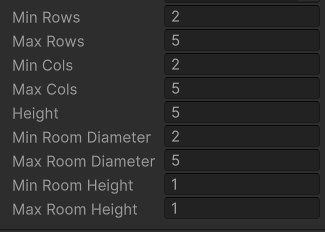
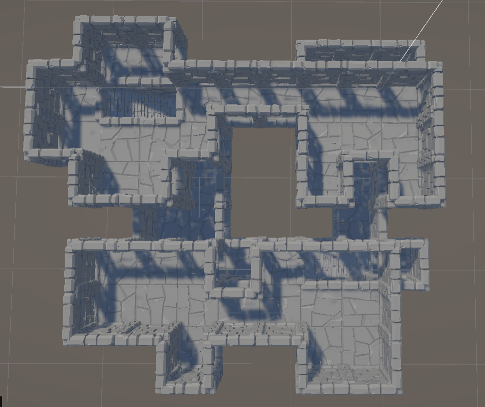
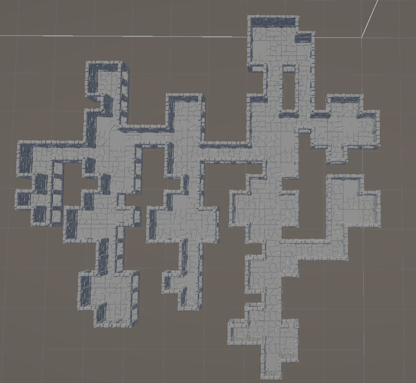
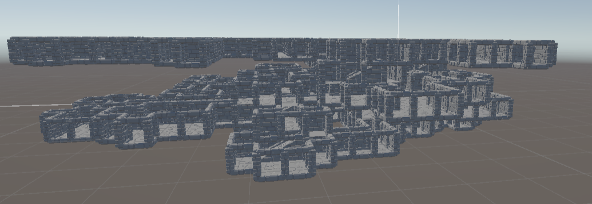
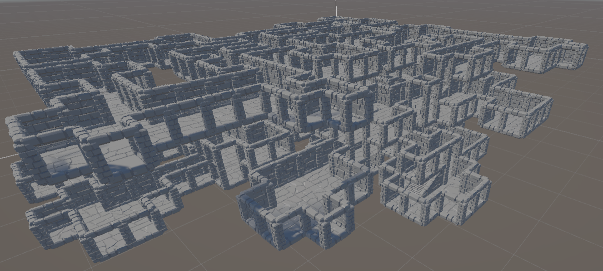
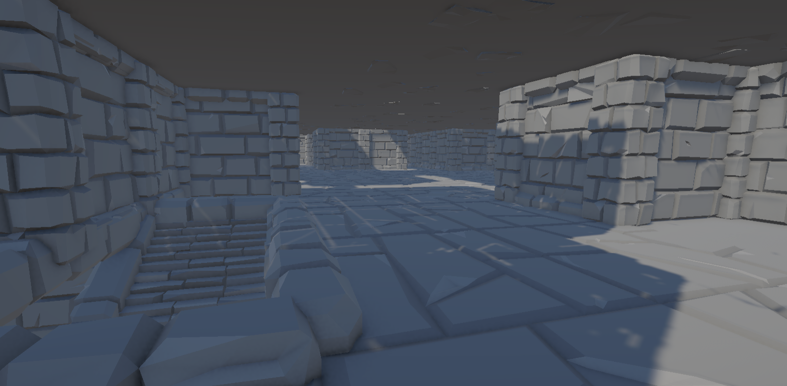
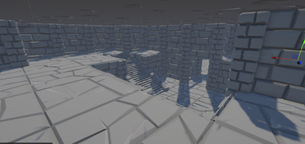
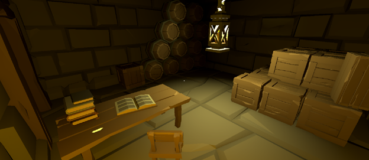
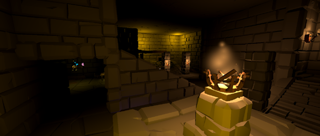

# Procedural 3D Dungeon Generator for Unity

This is a powerful and flexible procedural dungeon generator for Unity. It allows you to create complex and varied 3D dungeons with just a few clicks. The generator is highly customizable, allowing you to control the size, shape, and complexity of the generated dungeons.

## Features

*   **3D Dungeon Generation:** Generate multi-level dungeons with interconnected rooms and corridors.
*   **Highly Customizable:** Control various parameters to create dungeons that fit your specific needs.
*   **A* Pathfinding:** Uses the A* algorithm to create natural-looking paths between rooms.
*   **Minimum Spanning Tree:** Ensures all rooms are connected in a logical way.
*   **Easy to Use:** Simply add the `DungeonGenerator` script to a GameObject in your scene and configure the parameters in the Inspector.
*   **Scriptable Object-based Environment:** Easily swap out the visual assets used to build the dungeon.

## How it Works

The procedural generation of the dungeon is a multi-step process that takes a set of parameters and produces a fully explorable 3D dungeon. Here's a breakdown of the pipeline:

```csharp
// The main generation pipeline in Generator.DungeonGenerator
var rooms = new RoomGraph3D(...);
var pathGenerator = new PathGenerator();
var treeGenerator = new TreeGenerator();
var pathTree = treeGenerator.GenerateTree(rooms.ConvertListNodes());
var dungeon = Dungeon.GenerateDungeonMatrix(rooms.ConvertListRoom());
pathGenerator.GeneratePaths(dungeon, pathTree.ToPathTreeRoom());
visualizer.PaintDungeon(dungeon);
```

1.  **Room Generation (`RoomGraph3D`):** The process starts by creating a `RoomGraph3D`, which is a 3D grid of `Room` objects. The size and density of the grid are determined by the parameters you set in the Inspector. Each `Room` is generated with a random diameter and a shape determined by a `RandomWalkAreaGenerator`.

2.  **Room Positioning:** To prevent rooms from overlapping, the generator employs a deterministic positioning strategy. It iterates through the 3D grid of rooms and calculates the position of each room based on the diameters of its neighbors. This creates a clean, grid-like arrangement of rooms with a guaranteed gap between them.

3.  **Connectivity (`TreeGenerator`):** With the rooms in place, the `TreeGenerator` creates a *minimum spanning tree* to ensure that all rooms are connected. It uses a randomized algorithm to create a tree of paths, guaranteeing that there is a path from every room to every other room, while also adding some variation to the dungeon layout.

4.  **Pathfinding (`PathGenerator`):** The `PathGenerator` takes the path tree and carves out the corridors and hallways between the rooms. It uses the **A\* algorithm** to find the shortest and most natural-looking path between each pair of connected rooms. The A\* algorithm operates on a voxelized representation of the dungeon, ensuring that the paths navigate around obstacles and other rooms.

5.  **Visualization (`Visualizer`):** In the final step, the `Visualizer` takes the complete dungeon data, including the rooms and paths, and renders it in the Unity scene. It instantiates the prefabs you've defined in your `EnvironmentScriptableObject` (e.g., walls, floors, ceilings, doors) to build the final, explorable dungeon.

## Getting Started

To use the dungeon generator in your project, follow these steps:

1.  Clone or download this repository into your Unity project\'s `Assets` folder.
2.  Create a new scene or open an existing one.
3.  Create a new empty GameObject and add the `DungeonGenerator` script to it.
4.  Create a new `EnvironmentScriptableObject` and assign your environment prefabs (walls, floors, etc.) to it.
5.  Assign the `EnvironmentScriptableObject` to the `environments` field of the `DungeonGenerator` script in the Inspector.
6.  Configure the dungeon generation parameters in the Inspector (see below).
7.  Click the "Run Procedural Generation" button to generate a new dungeon.

## Configuration

You can configure the following parameters in the `DungeonGenerator` script in the Inspector:



*   **Min Rows:** The minimum number of rows of rooms.
*   **Max Rows:** The maximum number of rows of rooms.
*   **Min Cols:** The minimum number of columns of rooms.
*   **Max Cols:** The maximum number of columns of rooms.
*   **Height:** The number of floors in the dungeon.
*   **Min Room Diameter:** The minimum diameter of a room.
*   **Max Room Diameter:** The maximum diameter of a room.

## Showcase

Here are some examples of dungeons generated with this tool:

### Top-Down Views


*A small, 2-floor dungeon with a 2x2x2 room layout.*


*A medium-sized, single-floor dungeon.*

### 3D Views


*A side view of a large, multi-level dungeon.*


*A corner view of a large, multi-level dungeon.*

### In-Game Views


*A first-person view from within a generated dungeon.*


*A randomly generated dungeon with a nice aesthetic.*

### Target Aesthetic

These images show the target look and feel for the generated dungeons, with detailed props and lighting:


*A generated dungeon with detailed interior props like books, tables, and chairs.*


*A larger generated space with crystals in the distance.*

## Future Development

*   **Force-Based Room Layout:** Implement a force-based algorithm to create a more organic and configurable room layout. This will allow for more tightly packed rooms and more control over the spacing between them.
*   **Variable Room Heights:** Implement the ability to generate rooms with variable heights, using the `minRoomHeight` and `maxRoomHeight` parameters.
*   **Different Room Shapes:** Add support for different room shapes, such as rectangular, circular, or even more complex shapes.
*   **Smarter Prop Placement:** Add more props and decorative elements to the generated dungeons, and implement a system for placing them in a more meaningful way.
*   **Quests and Puzzles:** Implement a system for generating quests and puzzles within the dungeons.
